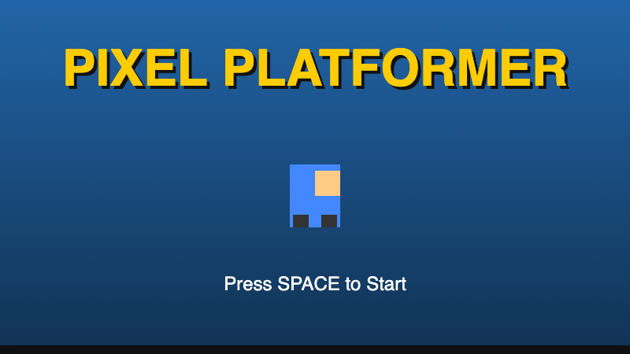

# Pixel Platformer

A purely vanilla JavaScript, HTML5 Canvas-based side-scrolling platformer with gravity, jumping, collectibles, enemies, and multiple levels. Everything is rendered purely procedurally without external assets or dependencies.

**Play the Demo:** [https://stonedhawk.github.io/pixel-platformer](https://stonedhawk.github.io/pixel-platformer)

## Features
- **3 Distinct Levels:** Green Hills, Underground, and Sky Fortress.
- **Physics and Mechanics:** Smooth jumping, terminal downward velocity, coyote time (6 frames), tile-based collision, and smooth camera lerping.
- **Dynamic Elements:** Collect coins for bonus points, stomp on patrolling enemies or strictly dodge them to survive, and avoid spike hazards.
- **Parallax Backgrounds:** Procedural canvas skies, clouds, caverns, and platforms moving seamlessly in parallax behind the action. 
- **Stats Integration:** Robust win-loss states, life counters, frame-perfect time bonuses per level.

## How to Play

| Action | Controls |
| :--- | :--- |
| **Move Left** | `A` or `Left Arrow` |
| **Move Right** | `D` or `Right Arrow` |
| **Jump** | `W`, `Up Arrow`, or `Spacebar` |
| **Menu / Next Level** | `Spacebar` |

*Lose all 3 lives and it's Game Over! Try to get the highest score by beating the time limit, grabbing coins, and squishing enemies.*

## Tech Stack
- Vanilla JavaScript
- HTML5 Canvas API (`requestAnimationFrame` Game Loop)
- Zero external dependencies. Everything runs natively in a single `index.html`.

## License
MIT License. Copyright (c) 2026 Rahul Shah.
