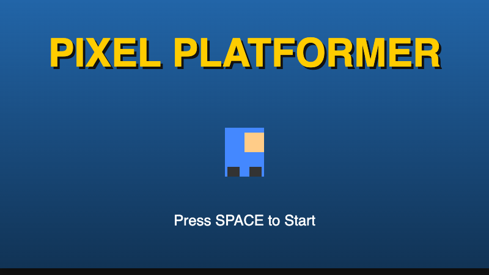

# 🕹️ Pixel Platformer

```text
  _____ _           _   ____  _       _       __                               
 |  __ (_)         | | |  _ \| |     | |     / _|                              
 | |__) |__  _____ | | | |_) | | __ _| |_ __| |_ ___  _ __ _ __ ___   ___ _ __ 
 |  ___/ \ \/ / _ \| | |  _ <| |/ _` | __/ _`  _/ _ \| '__| '_ ` _ \ / _ \ '__|
 | |   | |>  <  __/| | | |_) | | (_| | || (_| | (_) | |  | | | | | |  __/ |   
 |_|   |_/_/\_\___||_| |____/|_|\__,_|\__\__,_|_|___/|_|  |_| |_| |_|\___|_|   
```

[](https://developer.mozilla.org/en-US/docs/Web/JavaScript)
[](https://developer.mozilla.org/en-US/docs/Web/API/Canvas_API)
[](https://developer.mozilla.org/en-US/docs/Web/API/Web_Audio_API)
[](#)
[](LICENSE)

A gorgeous, highly polished **10-level side-scrolling pixel platformer** built purely from scratch using **Vanilla HTML5 Canvas and native JavaScript**. 

Every single visual asset—from the rotating gold relief coins, animated walking slimes, pattering spiked beetles, to the colossal level 10 boss with active HP feedback—is **procedurally drawn with coordinates and linear gradients**. The game features a fully synthesized **Web Audio API chiptune sound engine** that generates 8-bit sound effects dynamically in your browser, maintaining a strict **zero-dependency, single-file (`index.html`) architecture**.

⚡ **Play the Live Arcade Demo:** [https://stonedhawk.github.io/pixel-platformer](https://stonedhawk.github.io/pixel-platformer)

---

## 📸 Arcade Preview



---

## ✨ Features

### 🎨 High-Fidelity Juicy Visuals
*   **Procedural Pixel Art:** Custom drawn characters (with animated walking cycles, red caps, and overalls), bouncy slimes with moving pupils, spiked armored beetles with pattering legs, steel-plated hazard spikes, and stone portal structures enclosing swirling cosmic gradients.
*   **Colossal Final Boss:** Face a massive, animated purple **Pixel-Demon** on Level 10 equipped with neon horns, floating claws, furious glowing eyes, fanged jaws, and interactive damage flickering.
*   **Juicy Particle Emitter:** Dynamic, physics-driven particle explosions for player jumps, coin collections, enemy squishes, and character deaths.
*   **Interactive Screen Shake:** Impact satisfaction controller that shakes the screen during damage cues, enemy stomping, and boss hits.

### 🎵 8-Bit Chiptune Audio Synthesizer
*   A zero-dependency sound card utilizing the browser's native **Web Audio API** to synthesize classic retro game sounds on the fly.
*   **Synthesized SFX Palette:** Pitch-sweeping *Jumps*, dual-frequency ringing *Coin Chimes*, low-pass filtered *Explosion Stomps*, descending noise-crash *Damage Sweeps*, and cheerful triumphant *Level-Complete* & *Win* fanfares.
*   **State Persistence:** Upper-right retro HUD Mute Toggle that saves your sound preferences to `localStorage` across page loads.

### ⛰️ 10 Unique Biomes & Parallax Backgrounds
Every level features its own color scheme, glow styles, and beautifully rendered multi-layered procedural parallax elements:
1.  **Green Hills:** Sunny sky gradients with drifting cloud layers.
2.  **Underground Caverns:** Dark stone layers with overhead stalactites.
3.  **Sky Fortress:** Floating islands soaring through sky-blue clouds.
4.  **Snowy Peaks:** Drifting mountains amidst crisp alpine snowscapes.
5.  **Deep Dungeon:** Ancient cage layouts, heavy spikes, and dark shadows.
6.  **Canopy Jungle:** Dense vertical forest layer with vibrant green vines.
7.  **Abandoned Factory:** Smokey rust gradients and industrial block silhouettes.
8.  **Volcanic Core:** Deep red magma chambers with rising fire embers.
9.  **The Void:** Cosmic midnight layouts with drifting starfields.
10. **Final Boss Arena:** The deep red Demon Chamber.

### 🕹️ Professional Platformer Engine
*   **Coyote Time:** A 6-frame grace period allowing jumps shortly after running off platforms for responsive controls.
*   **Tile-Based Physics:** Accurate block collisions on axis-aligned bounding boxes (AABB) with smooth camera interpolation (`lerp`).
*   **Dynamic HUD:** Interactive score displays, gold counters, life bars (rendered in heart glyphs), and breakdown screens showing your scores, clear times, and level bonuses.

---

## 🎮 How To Play

Center yourself on the keyboard and guide your character through 10 biomes!

| Action | Controls | Key Cap |
| :--- | :--- | :--- |
| **Move Left** | `A` or `Left Arrow` | <kbd>A</kbd> / <kbd>←</kbd> |
| **Move Right** | `D` or `Right Arrow` | <kbd>D</kbd> / <kbd>→</kbd> |
| **Jump** | `W` or `Up Arrow` or `Spacebar` | <kbd>W</kbd> / <kbd>↑</kbd> / <kbd>Space</kbd> |
| **Menu / Advance** | `Spacebar` | <kbd>Space</kbd> |

💡 **Pro-Tip:** Gain high scores by defeating enemies (stomp them from above), collecting every rotating gold coin, and clearing levels quickly to secure the maximum **Time Clear Bonus**!

---

## 🛠️ Architecture & Core Mechanics

The entire engine runs within a self-contained game loop using standard web APIs.

### 🌀 The Native Chiptune Synthesizer
Instead of static MP3 or WAV files, the synthesizer uses native oscillators to construct waves mathematically. For example, the **Coin collect sound** plays a pristine C5 note, then ramps up to E5 80 milliseconds later:
```javascript
playCoin() {
    this.playTone(523.25, 523.25, 0.08, 'sine', 0.1, 0.01); // C5
    setTimeout(() => {
        this.playTone(659.25, 659.25, 0.25, 'sine', 0.1, 0.01); // E5
    }, 80);
}
```
*   **Gain Node Ramps:** Prevent auditory clicking by dynamically decreasing volume using exponential curves (`gainNode.gain.exponentialRampToValueAtTime`).
*   **Noise Buffers:** Stomp sounds and hits generate white noise arrays dynamically, routing them through standard high/low-pass filters to create deep explosions.

### 💨 Mathematical Coin Rotations
Coins simulate a rotating 3D gold relief coin by scaling their horizontal scale (`widthScale`) on absolute sinusoids:
```javascript
const angle = (frameCount + c.spinOffset) * 0.12;
const widthScale = Math.abs(Math.sin(angle));
ctx.translate(c.x + 16 - camera.x, c.y + 16);
ctx.scale(widthScale, 1);
```

---

## 🏗️ How to Extend & Customize

You can easily modify levels, biomes, or character parameters because the architecture is highly modular and documented.

### 🗺️ Designing a Custom Level
Levels are stored in indexable character arrays inside `index.html`. You can add new levels or edit existing ones using standard symbols:
*   `.` : Open Sky
*   `G` : Grass Platform (Grass top tile)
*   `#` : Underground Dirt Block
*   `S` : Spikes (Deadly Hazard)
*   `C` : Gold Coin
*   `E` : Enemy Patroller (Assigns slimes or beetles dynamically)
*   `D` : Stone Portal Door (Level Finish line)
*   `B` : Level 10 Colossal Demon Boss

**Example Level Matrix:**
```javascript
const myCustomLevel = [
    "..............................................................",
    ".......P.....................C...C..........GGG.....GGG.......",
    "......GGG...................GGG.GGG...........................",
    "......................C..................E....................",
    "...G.................GGG................GGG..........S........",
    "GGGGGGGGGGGGGGGG.GG.GGGGGGGGGGGGGGGGGGGGGGGGGGGGGGGGGGGGGGGGGG"
];
```

---

## 📄 License

This project is licensed under the MIT License - see the [LICENSE](LICENSE) file for details. Copyright (c) 2026 Rahul Shah.
